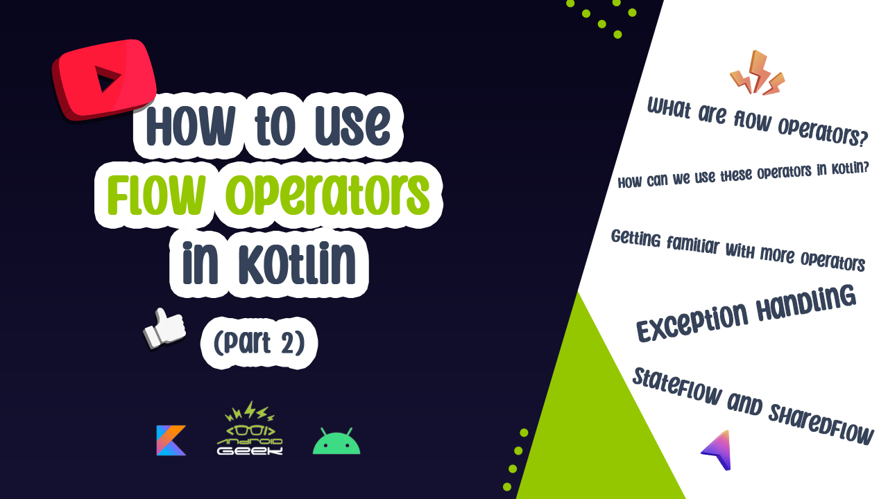

## Flow-Youtube

|||
|--|--|
|**Video Part1**|**Video Part2**|
|||

### Articles on Medium

- [Part1](https://medium.com/@ezatpanah/what-is-flow-in-kotlin-and-how-to-use-it-in-android-project-complete-guide-part-1-aa60375ff527)
- [Part2](https://androidgeek.co/how-to-use-flow-operators-in-kotlin-complete-guide-part-2-8c14adaa0349)

